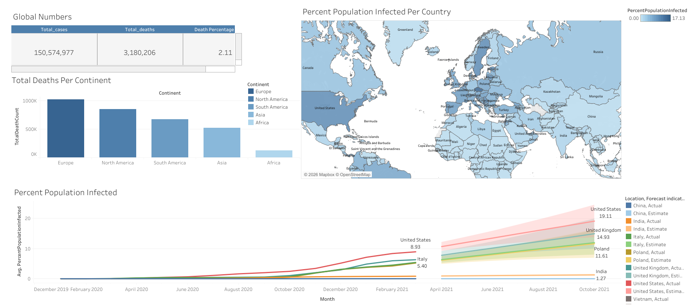

# COVID-19 Global Dashboard
### A Data Visualization Case Study on Pandemic Trends and Population Impact
**Tools:** Microsoft SQL Server, Microsoft Excel, Tableau Desktop / Tableau Public

**Data:** Our World in Data with 85,171 records across 219 locations, January 2020 to April 2021

**Live Demo:** https://trihieuvusl1.github.io/COVID19-Dashboard/

---

## Dashboard Preview



---

## Overview

Between January 2020 and April 2021, COVID-19 spread to every continent and infected over 150 million people worldwide. This dashboard was built to transform 85,000 rows of raw pandemic data into a clear visual narrative and it answers where the virus spread fastest, which regions suffered the most deaths, and how infection rates evolved over time across key countries.

The pipeline is straightforward: four SQL queries extract the most relevant slices of data from two source tables, the results are exported to Excel, and Tableau assembles them into a single unified dashboard.

---

## Data Sources

Two source files from Our World in Data's public COVID-19 dataset:

| File | Key Fields |
|---|---|
| `CovidDeaths.xlsx` | location, continent, date, total_cases, new_cases, total_deaths, new_deaths, population |
| `CovidVaccinations.xlsx` | location, date, new_vaccinations, total_vaccinations, people_fully_vaccinated |

Coverage spans 219 countries and territories across 6 continents from 1 January 2020 to 30 April 2021.

---

## Analytical Approach

Four SQL queries were written to extract the data behind each sheet in the dashboard.

**Query 1: Global KPI Summary**
Aggregates all country-level records (where `continent is not null`) to produce total confirmed cases, total deaths, and global death percentage.

**Query 2: Total Deaths by Continent**
Filters to continent-aggregate rows (where `continent is null`) and groups by location, excluding 'World', 'European Union', and 'International' to avoid double-counting.

**Query 3: Infection Rate by Country**
Groups by location and population, taking the maximum total cases per country and expressing it as a percentage of population — used to color the world map.

**Query 4: Infection Rate Over Time**
Extends Query 3 by adding date to the group, producing a time-series of percent population infected per country per day — used for the line chart.

---

## SQL Queries

```sql
-- Query 1: Global Summary
SELECT
    SUM(new_cases)                                       AS total_cases,
    SUM(CAST(new_deaths AS INT))                         AS total_deaths,
    SUM(CAST(new_deaths AS INT)) / SUM(new_cases) * 100  AS DeathPercentage
FROM PortfolioProject..CovidDeaths
WHERE continent IS NOT NULL
ORDER BY 1, 2;
```

```sql
-- Query 2: Total Deaths by Continent
SELECT
    location,
    SUM(CAST(new_deaths AS INT)) AS TotalDeathCount
FROM PortfolioProject..CovidDeaths
WHERE continent IS NULL
  AND location NOT IN ('World', 'European Union', 'International')
GROUP BY location
ORDER BY TotalDeathCount DESC;
```

```sql
-- Query 3: Highest Infection Rate by Country 
SELECT
    location,
    population,
    MAX(total_cases)                     AS HighestInfectionCount,
    MAX(total_cases / population) * 100  AS PercentPopulationInfected
FROM PortfolioProject..CovidDeaths
GROUP BY location, population
ORDER BY PercentPopulationInfected DESC;
```

```sql
-- Query 4: Infection Rate by Country Over Time
SELECT
    location,
    population,
    date,
    MAX(total_cases)                     AS HighestInfectionCount,
    MAX(total_cases / population) * 100  AS PercentPopulationInfected
FROM PortfolioProject..CovidDeaths
GROUP BY location, population, date
ORDER BY PercentPopulationInfected DESC;
```

---

## Dashboard Sheets

**Sheet 1: Global Numbers (KPI Table)**
Three headline metrics at a glance: 150,574,977 total cases, 3,180,206 total deaths, and a global death percentage of 2.11%.

**Sheet 2: Total Deaths Per Continent (Bar Chart)**
Ranks continents by absolute confirmed death count. Europe leads, followed by North America and South America, while Africa records the lowest count in the dataset.

**Sheet 3: Percent Population Infected Per Country (World Map)**
Each country is shaded by what percentage of its population was confirmed infected, on a scale from 0% to 17.13%. Europe shows the deepest concentration of dark shading, indicating the highest infection rates relative to population size.

**Sheet 4: Percent Population Infected Over Time (Line Chart)**
Tracks the average percent of population infected by month across selected countries, with Tableau forecast lines extending beyond April 2021. The United States leads at 8.93% actual and a forecast of 19.11% by late 2021, followed by the United Kingdom at 14.93%, Poland at 11.61%, Italy at 5.40%, and India at 1.27%.

---

## Key Insights

Europe had the highest death toll despite not being the most populous continent. The bar chart shows Europe surpassing 1 million total deaths, which is more than North America and South America combined. This points to the severity of early outbreaks in Italy, Spain, and the UK before containment measures took effect.

The United States was the fastest-spreading case in the dataset. The line chart shows the US pulling sharply ahead of all tracked countries from mid-2020 onward and reaching nearly 9% of the population infected by April 2021. The forecast line projects this could approach 19% by end of 2021 if the trajectory continued unchecked.

Western Europe dominates the world map in both spread and color intensity. Small, densely populated countries in Europe, which are visible as deep blue on the map, had the highest PercentPopulationInfected ratios. This reflects both genuine spread and relatively thorough testing and reporting compared to other regions.

Asia and Africa appear significantly lighter on the map, but this likely reflects reporting gaps as much as lower transmission. India, despite having one of the world's largest populations, recorded only 1.27% population infected by April 2021, and this figure is widely considered an undercount given limited testing infrastructure at the time.

The pandemic's acceleration was not linear. The line chart shows near-flat curves through the first half of 2020, followed by a steep inflection point in October 2020 that continued through April 2021. This second wave was structurally different from the first because it was faster, broader, and affecting countries that had managed to suppress the first wave relatively well.

---

## Workflow

```
Our World in Data (raw data)
        |
        v
Microsoft Excel  ──  CovidDeaths.xlsx + CovidVaccinations.xlsx
        |
        v
SQL Server  ──  4 queries → 4 result sets exported to Excel
        |
        v
Tableau Desktop  ──  4 sheets assembled into Dashboard 1
        |
        v
Tableau Public → Embedded via GitHub Pages
```

---

## Repository Structure

```
COVID19-Dashboard/
    README.md
    Tableau_Project_SQL_Queries.sql
    data/
        CovidDeaths.xlsx
        CovidVaccinations.xlsx
    images/
        Dashboard_1.png
    Covid_Dashbroad.twbx
    index.html
```

---

## References

Our World in Data - COVID-19 Deaths and Vaccinations Dataset: https://ourworldindata.org/covid-deaths

Johns Hopkins University CSSE - COVID-19 Data Repository: https://github.com/CSSEGISandData/COVID-19

World Health Organization - COVID-19 Dashboard: https://covid19.who.int/
